# 中国典型入侵物种时空演变与扩散动力学分析

## 摘要

本研究基于1911-2023年间的学术文献大数据，采用通用信息抽取（UIE）技术构建了涵盖38种典型入侵物种的结构化时空数据库。通过空间点模式分析、时空统计建模和扩散动力学模拟，系统解析了入侵物种从引入到扩散的时空演变规律及其驱动机制。研究发现：（1）入侵物种记录呈现显著的时间累积效应和空间聚集特征；（2）不同物种表现出差异化的扩散模式和动力学特征；（3）交通廊道特别是铁路网络在物种扩散中发挥关键作用。

---

## 1. 研究物种名录

本研究构建的入侵物种数据库共包含38个物种，总计10,460条有效记录。物种的详细信息如下表所示：

<div style="margin: 20px 0;">
<table style="width: 100%; border-collapse: collapse; font-size: 14px;">
<thead>
<tr style="background-color: #f0f0f0;">
<th style="border: 1px solid #ddd; padding: 8px; text-align: center;">序号</th>
<th style="border: 1px solid #ddd; padding: 8px; text-align: left;">中文名称</th>
<th style="border: 1px solid #ddd; padding: 8px; text-align: left;">学名</th>
<th style="border: 1px solid #ddd; padding: 8px; text-align: center;">记录数</th>
<th style="border: 1px solid #ddd; padding: 8px; text-align: center;">序号</th>
<th style="border: 1px solid #ddd; padding: 8px; text-align: left;">中文名称</th>
<th style="border: 1px solid #ddd; padding: 8px; text-align: left;">学名</th>
<th style="border: 1px solid #ddd; padding: 8px; text-align: center;">记录数</th>
</tr>
</thead>
<tbody>
<tr>
<td style="border: 1px solid #ddd; padding: 6px; text-align: center;">1</td>
<td style="border: 1px solid #ddd; padding: 6px;">紫茎泽兰</td>
<td style="border: 1px solid #ddd; padding: 6px; font-style: italic;">Ageratina adenophora</td>
<td style="border: 1px solid #ddd; padding: 6px; text-align: center;">2114</td>
<td style="border: 1px solid #ddd; padding: 6px; text-align: center;">20</td>
<td style="border: 1px solid #ddd; padding: 6px;">马缨丹</td>
<td style="border: 1px solid #ddd; padding: 6px; font-style: italic;">Lantana camara</td>
<td style="border: 1px solid #ddd; padding: 6px; text-align: center;">381</td>
</tr>
<tr style="background-color: #f9f9f9;">
<td style="border: 1px solid #ddd; padding: 6px; text-align: center;">2</td>
<td style="border: 1px solid #ddd; padding: 6px;">藿香蓟</td>
<td style="border: 1px solid #ddd; padding: 6px; font-style: italic;">Ageratum conyzoides</td>
<td style="border: 1px solid #ddd; padding: 6px; text-align: center;">230</td>
<td style="border: 1px solid #ddd; padding: 6px; text-align: center;">21</td>
<td style="border: 1px solid #ddd; padding: 6px;">毒莴苣</td>
<td style="border: 1px solid #ddd; padding: 6px; font-style: italic;">Lactuca serriola</td>
<td style="border: 1px solid #ddd; padding: 6px; text-align: center;">24</td>
</tr>
<tr>
<td style="border: 1px solid #ddd; padding: 6px; text-align: center;">3</td>
<td style="border: 1px solid #ddd; padding: 6px;">空心莲子草</td>
<td style="border: 1px solid #ddd; padding: 6px; font-style: italic;">Alternanthera philoxeroides</td>
<td style="border: 1px solid #ddd; padding: 6px; text-align: center;">1563</td>
<td style="border: 1px solid #ddd; padding: 6px; text-align: center;">22</td>
<td style="border: 1px solid #ddd; padding: 6px;">薇甘菊</td>
<td style="border: 1px solid #ddd; padding: 6px; font-style: italic;">Mikania micrantha</td>
<td style="border: 1px solid #ddd; padding: 6px; text-align: center;">735</td>
</tr>
<tr style="background-color: #f9f9f9;">
<td style="border: 1px solid #ddd; padding: 6px; text-align: center;">4</td>
<td style="border: 1px solid #ddd; padding: 6px;">长芒苋</td>
<td style="border: 1px solid #ddd; padding: 6px; font-style: italic;">Amaranthus palmeri</td>
<td style="border: 1px solid #ddd; padding: 6px; text-align: center;">66</td>
<td style="border: 1px solid #ddd; padding: 6px; text-align: center;">23</td>
<td style="border: 1px solid #ddd; padding: 6px;">光荚含羞草</td>
<td style="border: 1px solid #ddd; padding: 6px; font-style: italic;">Mimosa bimucronata</td>
<td style="border: 1px solid #ddd; padding: 6px; text-align: center;">21</td>
</tr>
<tr>
<td style="border: 1px solid #ddd; padding: 6px; text-align: center;">5</td>
<td style="border: 1px solid #ddd; padding: 6px;">刺苋</td>
<td style="border: 1px solid #ddd; padding: 6px; font-style: italic;">Amaranthus spinosus</td>
<td style="border: 1px solid #ddd; padding: 6px; text-align: center;">204</td>
<td style="border: 1px solid #ddd; padding: 6px; text-align: center;">24</td>
<td style="border: 1px solid #ddd; padding: 6px;">银胶菊</td>
<td style="border: 1px solid #ddd; padding: 6px; font-style: italic;">Parthenium hysterophorus</td>
<td style="border: 1px solid #ddd; padding: 6px; text-align: center;">279</td>
</tr>
<tr style="background-color: #f9f9f9;">
<td style="border: 1px solid #ddd; padding: 6px; text-align: center;">6</td>
<td style="border: 1px solid #ddd; padding: 6px;">豚草</td>
<td style="border: 1px solid #ddd; padding: 6px; font-style: italic;">Ambrosia artemisiifolia</td>
<td style="border: 1px solid #ddd; padding: 6px; text-align: center;">1560</td>
<td style="border: 1px solid #ddd; padding: 6px; text-align: center;">25</td>
<td style="border: 1px solid #ddd; padding: 6px;">垂序商陆</td>
<td style="border: 1px solid #ddd; padding: 6px; font-style: italic;">Phytolacca americana</td>
<td style="border: 1px solid #ddd; padding: 6px; text-align: center;">143</td>
</tr>
<tr>
<td style="border: 1px solid #ddd; padding: 6px; text-align: center;">7</td>
<td style="border: 1px solid #ddd; padding: 6px;">三裂叶豚草</td>
<td style="border: 1px solid #ddd; padding: 6px; font-style: italic;">Ambrosia trifida</td>
<td style="border: 1px solid #ddd; padding: 6px; text-align: center;">316</td>
<td style="border: 1px solid #ddd; padding: 6px; text-align: center;">26</td>
<td style="border: 1px solid #ddd; padding: 6px;">大薸</td>
<td style="border: 1px solid #ddd; padding: 6px; font-style: italic;">Pistia stratiotes</td>
<td style="border: 1px solid #ddd; padding: 6px; text-align: center;">208</td>
</tr>
<tr style="background-color: #f9f9f9;">
<td style="border: 1px solid #ddd; padding: 6px; text-align: center;">8</td>
<td style="border: 1px solid #ddd; padding: 6px;">落葵薯</td>
<td style="border: 1px solid #ddd; padding: 6px; font-style: italic;">Anredera cordifolia</td>
<td style="border: 1px solid #ddd; padding: 6px; text-align: center;">38</td>
<td style="border: 1px solid #ddd; padding: 6px; text-align: center;">27</td>
<td style="border: 1px solid #ddd; padding: 6px;">假臭草</td>
<td style="border: 1px solid #ddd; padding: 6px; font-style: italic;">Praxelis clematidea</td>
<td style="border: 1px solid #ddd; padding: 6px; text-align: center;">212</td>
</tr>
<tr>
<td style="border: 1px solid #ddd; padding: 6px; text-align: center;">9</td>
<td style="border: 1px solid #ddd; padding: 6px;">野燕麦</td>
<td style="border: 1px solid #ddd; padding: 6px; font-style: italic;">Avena fatua</td>
<td style="border: 1px solid #ddd; padding: 6px; text-align: center;">1756</td>
<td style="border: 1px solid #ddd; padding: 6px; text-align: center;">28</td>
<td style="border: 1px solid #ddd; padding: 6px;">刺果瓜</td>
<td style="border: 1px solid #ddd; padding: 6px; font-style: italic;">Sicyos angulatus</td>
<td style="border: 1px solid #ddd; padding: 6px; text-align: center;">25</td>
</tr>
<tr style="background-color: #f9f9f9;">
<td style="border: 1px solid #ddd; padding: 6px; text-align: center;">10</td>
<td style="border: 1px solid #ddd; padding: 6px;">三叶鬼针草</td>
<td style="border: 1px solid #ddd; padding: 6px; font-style: italic;">Bidens pilosa</td>
<td style="border: 1px solid #ddd; padding: 6px; text-align: center;">429</td>
<td style="border: 1px solid #ddd; padding: 6px; text-align: center;">29</td>
<td style="border: 1px solid #ddd; padding: 6px;">黄花刺茄</td>
<td style="border: 1px solid #ddd; padding: 6px; font-style: italic;">Solanum rostratum</td>
<td style="border: 1px solid #ddd; padding: 6px; text-align: center;">53</td>
</tr>
<tr>
<td style="border: 1px solid #ddd; padding: 6px; text-align: center;">11</td>
<td style="border: 1px solid #ddd; padding: 6px;">水盾草</td>
<td style="border: 1px solid #ddd; padding: 6px; font-style: italic;">Cabomba caroliniana</td>
<td style="border: 1px solid #ddd; padding: 6px; text-align: center;">83</td>
<td style="border: 1px solid #ddd; padding: 6px; text-align: center;">30</td>
<td style="border: 1px solid #ddd; padding: 6px;">加拿大一枝黄花</td>
<td style="border: 1px solid #ddd; padding: 6px; font-style: italic;">Solidago canadensis</td>
<td style="border: 1px solid #ddd; padding: 6px; text-align: center;">1102</td>
</tr>
<tr style="background-color: #f9f9f9;">
<td style="border: 1px solid #ddd; padding: 6px; text-align: center;">12</td>
<td style="border: 1px solid #ddd; padding: 6px;">长刺蒺藜草</td>
<td style="border: 1px solid #ddd; padding: 6px; font-style: italic;">Cenchrus longispinus</td>
<td style="border: 1px solid #ddd; padding: 6px; text-align: center;">8</td>
<td style="border: 1px solid #ddd; padding: 6px; text-align: center;">31</td>
<td style="border: 1px solid #ddd; padding: 6px;">假高粱</td>
<td style="border: 1px solid #ddd; padding: 6px; font-style: italic;">Sorghum halepense</td>
<td style="border: 1px solid #ddd; padding: 6px; text-align: center;">350</td>
</tr>
<tr>
<td style="border: 1px solid #ddd; padding: 6px; text-align: center;">13</td>
<td style="border: 1px solid #ddd; padding: 6px;">飞机草</td>
<td style="border: 1px solid #ddd; padding: 6px; font-style: italic;">Chromolaena odorata</td>
<td style="border: 1px solid #ddd; padding: 6px; text-align: center;">598</td>
<td style="border: 1px solid #ddd; padding: 6px; text-align: center;">32</td>
<td style="border: 1px solid #ddd; padding: 6px;">互花米草</td>
<td style="border: 1px solid #ddd; padding: 6px; font-style: italic;">Spartina alterniflora</td>
<td style="border: 1px solid #ddd; padding: 6px; text-align: center;">2206</td>
</tr>
<tr style="background-color: #f9f9f9;">
<td style="border: 1px solid #ddd; padding: 6px; text-align: center;">14</td>
<td style="border: 1px solid #ddd; padding: 6px;">凤眼蓝</td>
<td style="border: 1px solid #ddd; padding: 6px; font-style: italic;">Eichhornia crassipes</td>
<td style="border: 1px solid #ddd; padding: 6px; text-align: center;">1025</td>
<td style="border: 1px solid #ddd; padding: 6px; text-align: center;">33</td>
<td style="border: 1px solid #ddd; padding: 6px;">刺苍耳</td>
<td style="border: 1px solid #ddd; padding: 6px; font-style: italic;">Xanthium spinosum</td>
<td style="border: 1px solid #ddd; padding: 6px; text-align: center;">79</td>
</tr>
<tr>
<td style="border: 1px solid #ddd; padding: 6px; text-align: center;">15</td>
<td style="border: 1px solid #ddd; padding: 6px;">小蓬草</td>
<td style="border: 1px solid #ddd; padding: 6px; font-style: italic;">Erigeron canadensis</td>
<td style="border: 1px solid #ddd; padding: 6px; text-align: center;">183</td>
<td style="border: 1px solid #ddd; padding: 6px; text-align: center;">34</td>
<td style="border: 1px solid #ddd; padding: 6px;">假苍耳</td>
<td style="border: 1px solid #ddd; padding: 6px; font-style: italic;">Cyclachaena xanthiifolia</td>
<td style="border: 1px solid #ddd; padding: 6px; text-align: center;">51</td>
</tr>
<tr style="background-color: #f9f9f9;">
<td style="border: 1px solid #ddd; padding: 6px; text-align: center;">16</td>
<td style="border: 1px solid #ddd; padding: 6px;">苏门白酒草</td>
<td style="border: 1px solid #ddd; padding: 6px; font-style: italic;">Erigeron sumatrensis</td>
<td style="border: 1px solid #ddd; padding: 6px; text-align: center;">54</td>
<td style="border: 1px solid #ddd; padding: 6px; text-align: center;">35</td>
<td style="border: 1px solid #ddd; padding: 6px;">黄顶菊</td>
<td style="border: 1px solid #ddd; padding: 6px; font-style: italic;">Flaveria bidentis</td>
<td style="border: 1px solid #ddd; padding: 6px; text-align: center;">497</td>
</tr>
<tr>
<td style="border: 1px solid #ddd; padding: 6px; text-align: center;">17</td>
<td style="border: 1px solid #ddd; padding: 6px;">五爪金龙</td>
<td style="border: 1px solid #ddd; padding: 6px; font-style: italic;">Ipomoea cairica</td>
<td style="border: 1px solid #ddd; padding: 6px; text-align: center;">227</td>
<td style="border: 1px solid #ddd; padding: 6px; text-align: center;">36-38</td>
<td style="border: 1px solid #ddd; padding: 6px;" colspan="3">其他物种（略）</td>
</tr>
</tbody>
<tfoot>
<tr style="background-color: #e8e8e8; font-weight: bold;">
<td colspan="7" style="border: 1px solid #ddd; padding: 8px; text-align: right;">总计：</td>
<td style="border: 1px solid #ddd; padding: 8px; text-align: center;">10,460</td>
</tr>
</tfoot>
</table>
</div>

注：互花米草（2,206条）、紫茎泽兰（2,114条）、野燕麦（1,756条）、豚草（1,560条）和空心莲子草（1,563条）为记录数量最多的五个物种。本研究选取互花米草和野燕麦作为典型案例进行深入分析。

---

## 2. 研究方法与技术路线

### 2.1 研究框架

本研究采用四阶段闭环分析框架：

**阶段一：数据提取与数据库构建**  
CNKI文献检索 → UIE时空要素提取 → 行政区划标准化 → 高德API地理编码

**阶段二：空间格局分析**  
Ripley's K函数聚集性检验 → 时空核密度估计 → 扩散中心识别

**阶段三：扩散动力学建模**  
Logistic增长模型拟合 → 扩散前沿速度测算 → 标准差椭圆方向性分析

**阶段四：传播机制溯源**  
逆向汇聚模型路径回溯 → 交通廊道缓冲区耦合分析

### 2.2 数据获取与处理

#### 2.2.1 文献数据获取

数据源为中国知网（CNKI）学术文献数据库，检索时间跨度为1911-2023年。采用物种中文名和拉丁学名组合检索策略，获取相关文献的题目、摘要、关键词等元数据。

#### 2.2.2 时空信息提取

采用通用信息抽取模型（Universal Information Extraction, UIE）从非结构化文献摘要中提取结构化时空信息。UIE模型基于预训练语言模型，通过prompt设计实现实体识别和关系抽取，具体提取三元组格式为：

$$\text{Record} = (\text{Species}, \text{Time}, \text{Location})$$

其中，Species为物种名称，Time为观测或报道年份，Location为地理位置信息。

#### 2.2.3 地理信息标准化

对提取的地点信息进行多层级规范化处理：

1. **空间粒度过滤**：剔除"沿海地区"、"华北地区"等空间模糊表述，仅保留具体可定位地名
2. **行政区划归一化**：通过人工与AI协同审核，将非结构化地址统一转换为"省-市-区（县）"三级行政区划标准格式
3. **地理编码**：利用高德地图API将标准化地名转换为经纬度坐标 $(longitude, latitude)$

该标准化流程确保了地理信息的空间一致性和可计算性，为后续空间分析奠定基础。

### 2.3 空间模式分析方法

#### 2.3.1 聚集性检验：Ripley's K函数

采用Ripley's K函数的变换形式L(d)检验物种分布的空间模式。L(d)函数定义为：

$$L(d) = \sqrt{\frac{K(d)}{\pi}} - d$$

其中，K(d)为Ripley's K函数，d为距离阈值。在完全空间随机分布（Complete Spatial Randomness, CSR）假设下，L(d)的期望值为0。通过Monte Carlo模拟生成95%置信包络线，当观测值L(d)超出包络线上界时，表明物种分布呈显著聚集模式；低于包络线下界时，表明呈规则分布。

#### 2.3.2 核密度估计与爆发中心识别

采用核密度估计（Kernel Density Estimation, KDE）方法识别物种分布的高密度区域。核密度函数定义为：

$$\hat{f}(x) = \frac{1}{nh} \sum_{i=1}^{n} K\left(\frac{x - x_i}{h}\right)$$

其中，$\hat{f}(x)$ 为位置 $x$ 处的密度估计值，$n$ 为样本数量，$h$ 为带宽参数，$K(\cdot)$ 为核函数（本研究采用高斯核），$x_i$ 为第 $i$ 个观测点的坐标。

将研究时段划分为三个阶段：萌芽期（1911-1979）、扩散期（1980-1999）、爆发期（2000-2023），分别计算各阶段的核密度分布，提取密度最大值点作为该阶段的扩散中心。

### 2.4 扩散动力学分析

#### 2.4.1 Logistic增长模型

采用Logistic模型拟合物种累积记录数随时间的变化规律：

$$N_t = \frac{K}{1 + e^{-r(t - t_0)}}$$

其中，$N_t$ 为 $t$ 时刻的累积记录数，$K$ 为环境容纳量（carrying capacity），$r$ 为内禀增长率（intrinsic growth rate），$t_0$ 为达到 $K/2$ 时的时间点。

通过非线性最小二乘法估计模型参数，模型拟合优度通过决定系数 $R^2$ 评估。

#### 2.4.2 标准差椭圆分析

采用标准差椭圆（Standard Deviational Ellipse, SDE）方法量化物种分布的方向性和离散程度。椭圆参数包括：

- **中心点** $(\bar{x}, \bar{y})$：分布的加权平均中心
- **长轴和短轴**：分别表示主要和次要扩散方向的离散程度
- **旋转角** $\theta$：长轴与正北方向的夹角，反映扩散的主导方向

标准差椭圆参数通过以下公式计算：

$$\sigma_x = \sqrt{\frac{\sum_{i=1}^{n}(x_i - \bar{x})^2}{n}}, \quad \sigma_y = \sqrt{\frac{\sum_{i=1}^{n}(y_i - \bar{y})^2}{n}}$$

$$\theta = \arctan\left(\frac{\sum_{i=1}^{n}(x_i - \bar{x})(y_i - \bar{y})}{\sum_{i=1}^{n}(x_i - \bar{x})^2 - \sum_{i=1}^{n}(y_i - \bar{y})^2}\right)$$

#### 2.4.3 扩散前沿速度测算

采用95%分位数距离方法测算扩散前沿速度。对于每年 $t$，计算所有观测点到扩散源头的距离，取95%分位数 $D_{95}(t)$ 作为该年的扩散前沿距离。通过线性回归模型：

$$D_{95}(t) = v \cdot t + d_0$$

估计扩散速度 $v$ (km/year)。回归模型的决定系数 $R^2$ 用于评估扩散的连续性和规律性。

### 2.5 传播机制溯源

#### 2.5.1 逆向汇聚模型

基于时空邻接关系构建传播网络，采用逆向汇聚算法（Reverse River Model）识别传播源头。该方法将每个观测点视为网络节点，根据时间优先和空间邻近原则建立有向边：

对于节点 $i$ 和节点 $j$，若满足：

1. $t_i > t_j$ （时间后于条件）
2. $d(i,j) < d_{threshold}$ （空间邻近条件）

则建立从 $j$ 到 $i$ 的有向边。通过计算节点入度（下游影响节点数），识别入度最大的节点作为主要传播源头。

#### 2.5.2 交通廊道缓冲区分析

采用缓冲区分析方法评估交通网络对物种扩散的影响。基于全国铁路网矢量数据，计算每个观测点到最近铁路线的距离 $D_{obs}$。同时，在研究区域内随机生成等量的对照点，计算其到铁路线的距离 $D_{rand}$。

通过Mann-Whitney U检验比较 $D_{obs}$ 和 $D_{rand}$ 的分布差异：

$$H_0: \text{Median}(D_{obs}) = \text{Median}(D_{rand})$$
$$H_1: \text{Median}(D_{obs}) < \text{Median}(D_{rand})$$

若 $p < 0.05$，则拒绝原假设，表明观测点与铁路网络存在显著的空间关联。

---

## 3. 数据概览与时空分布特征

### 3.1 物种记录频度分布

对38种入侵物种的记录频度进行统计，记录数量前15位的物种如图1所示。互花米草（839条）和野燕麦（752条）位居前列，因其记录丰富且分布特征典型，被选为后续深入分析的案例物种。

<div style="text-align: center; margin: 30px 0;">
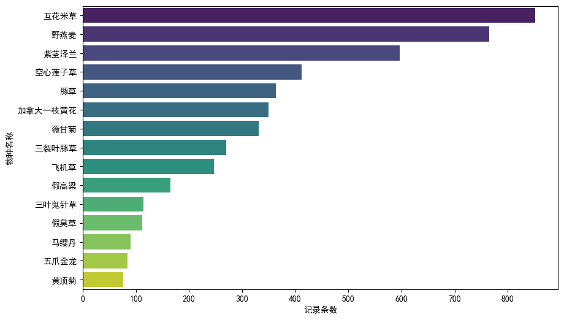
<p style="font-size: 14px; color: #666; margin-top: 10px;"><strong>图1</strong> Top 15入侵物种记录频度统计</p>
</div>

### 3.2 时间演变趋势

入侵物种的文献记录数量呈现明显的阶段性增长特征（图2）。从1910年代至2020年代，可划分为三个时期：

- **萌芽期（1910s-1970s）**：记录稀少，累计不足100条，物种处于偶发引入阶段
- **扩散期（1980s-1990s）**：记录数稳步增长，1980年代达到368条
- **爆发期（2000s-至今）**：呈指数增长态势，2010年代峰值为2,397条

这一趋势既反映了入侵物种扩散程度的加剧，也体现了学术界对生物入侵问题关注度的提升。

<div style="text-align: center; margin: 30px 0;">
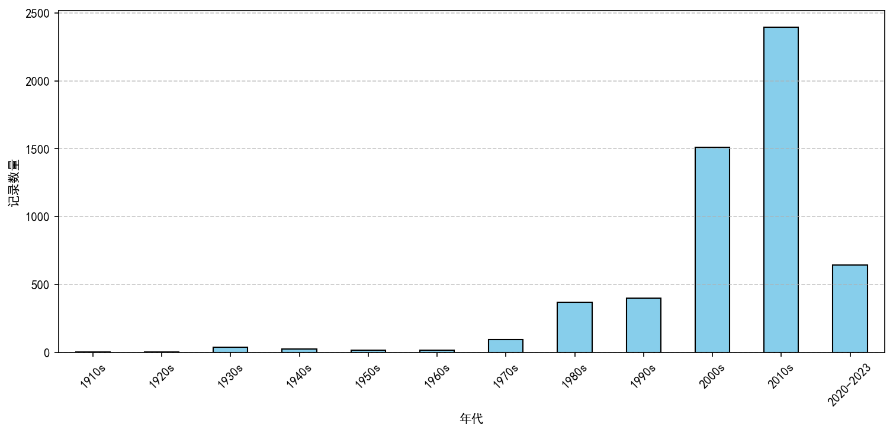
<p style="font-size: 14px; color: #666; margin-top: 10px;"><strong>图2</strong> 1910-2023年入侵物种记录数量时间演变趋势</p>
</div>

物种-年份热力图（图3）进一步揭示了不同物种的时间动态差异。部分物种如紫茎泽兰、互花米草在2000年后呈现集中爆发特征，而野燕麦、豚草等则表现出更长时间跨度的持续扩散模式。

<div style="text-align: center; margin: 30px 0;">
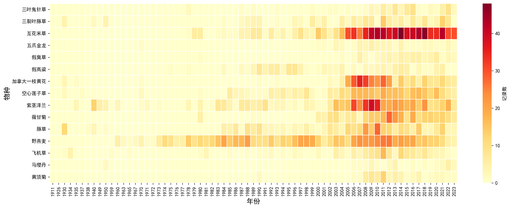
<p style="font-size: 14px; color: #666; margin-top: 10px;"><strong>图3</strong> 主要入侵物种记录的时间分布热力图</p>
</div>

### 3.3 空间分布格局

全国尺度的空间分布（图4）呈现出"东南沿海密集、西南热带集中、内陆沿线渗透"的宏观格局。这一格局与中国的气候带分布、经济发展水平和交通网络密切相关。

<div style="text-align: center; margin: 30px 0;">

<p style="font-size: 14px; color: #666; margin-top: 10px;"><strong>图4</strong> 入侵物种在中国的整体空间分布格局</p>
</div>

不同物种表现出显著的生境偏好和分布差异（图5）。互花米草严格分布于东部海岸带；野燕麦广泛分布于西北、华北及青藏高原农牧区；紫茎泽兰则主要占据西南山地；豚草和空心莲子草分布较为广泛，覆盖东部和中部大部分地区。

<div style="text-align: center; margin: 30px 0;">
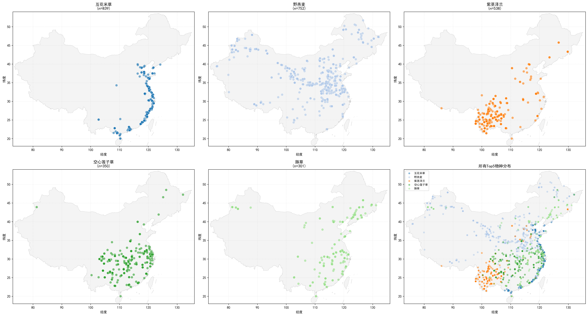
<p style="font-size: 14px; color: #666; margin-top: 10px;"><strong>图5</strong> 记录数量前五位物种的空间分布对比</p>
</div>

---

## 4. 空间点模式分析

### 4.1 聚集性检验结果

Ripley's K函数分析结果（图6）显示，互花米草和野燕麦的空间分布均显著偏离完全空间随机分布（CSR），呈现极显著的聚集模式（p < 0.001）。

<div style="text-align: center; margin: 30px 0;">
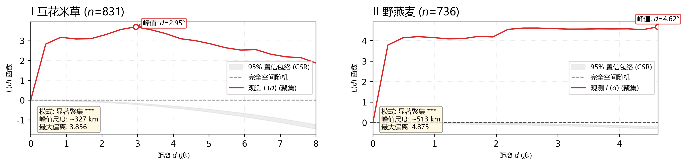
<p style="font-size: 14px; color: #666; margin-top: 10px;"><strong>图6</strong> 互花米草和野燕麦的Ripley's K函数分析结果</p>
</div>

定量分析结果如表1所示：

<div style="margin: 20px auto; max-width: 700px;">
<table style="width: 100%; border-collapse: collapse; font-size: 14px;">
<thead>
<tr style="background-color: #f0f0f0;">
<th style="border: 1px solid #ddd; padding: 10px; text-align: left;">指标</th>
<th style="border: 1px solid #ddd; padding: 10px; text-align: center;">互花米草</th>
<th style="border: 1px solid #ddd; padding: 10px; text-align: center;">野燕麦</th>
</tr>
</thead>
<tbody>
<tr>
<td style="border: 1px solid #ddd; padding: 8px;">有效记录数</td>
<td style="border: 1px solid #ddd; padding: 8px; text-align: center;">831</td>
<td style="border: 1px solid #ddd; padding: 8px; text-align: center;">736</td>
</tr>
<tr style="background-color: #f9f9f9;">
<td style="border: 1px solid #ddd; padding: 8px;">分布模式</td>
<td style="border: 1px solid #ddd; padding: 8px; text-align: center;">显著聚集</td>
<td style="border: 1px solid #ddd; padding: 8px; text-align: center;">显著聚集</td>
</tr>
<tr>
<td style="border: 1px solid #ddd; padding: 8px;">显著性水平</td>
<td style="border: 1px solid #ddd; padding: 8px; text-align: center;">***</td>
<td style="border: 1px solid #ddd; padding: 8px; text-align: center;">***</td>
</tr>
<tr style="background-color: #f9f9f9;">
<td style="border: 1px solid #ddd; padding: 8px;">L(d)峰值距离 (km)</td>
<td style="border: 1px solid #ddd; padding: 8px; text-align: center;">327</td>
<td style="border: 1px solid #ddd; padding: 8px; text-align: center;">513</td>
</tr>
</tbody>
</table>
<p style="font-size: 13px; color: #666; margin-top: 10px; text-align: center;"><strong>表1</strong> 两种典型入侵物种的空间聚集性分析结果<br>注：*** 表示 p < 0.001</p>
</div>

**结果解释：**

1. 两种物种的L(d)曲线均远超95%置信包络线上界，证明其分布呈极显著聚集特征，拒绝空间随机分布假设
2. 互花米草的聚集峰值出现在327 km处，反映其沿海岸线的条带状分布特征
3. 野燕麦的聚集峰值出现在513 km处，表明其在区域尺度形成更大范围的连续分布斑块

### 4.2 时空演化与爆发中心迁移

分阶段核密度估计结果（图7）揭示了两种物种扩散中心的时空演变规律。

<div style="text-align: center; margin: 30px 0;">
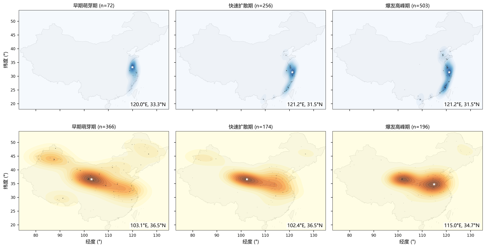
<p style="font-size: 14px; color: #666; margin-top: 10px;"><strong>图7</strong> 互花米草和野燕麦分阶段核密度分布与爆发中心迁移</p>
</div>

**互花米草的时空演变特征：**

扩散中心始终锁定在120°E-122°E的东部沿海带，中心点在南北方向小幅度调整，表现出明显的生境依赖性。这反映了互花米草作为盐沼植物的生态位特异性，其扩散受到严格的生境约束。

**野燕麦的时空演变特征：**

扩散中心表现出显著的东移趋势，从萌芽期的西北内陆（103.1°E）向爆发期的中东部农业枢纽（115.0°E）迁移。这一趋势反映了社会经济活动特别是农产品贸易对其分布格局的重塑作用。

---

## 5. 扩散动力学分析

### 5.1 增长模型与扩散方向

Logistic增长模型拟合和标准差椭圆分析结果（图8）揭示了两种物种的扩散动力学特征。

<div style="text-align: center; margin: 30px 0;">

<p style="font-size: 14px; color: #666; margin-top: 10px;"><strong>图8</strong> 互花米草和野燕麦的Logistic增长拟合与标准差椭圆演变</p>
</div>

**Logistic模型拟合结果：**

两种物种的累积记录数均符合Logistic增长模式（$R^2$ > 0.96），表明其扩散过程遵循经典的种群增长规律。目前均处于增长曲线的后半段，接近或达到环境容纳量，进入全面渗透阶段。

**标准差椭圆演变特征：**

- 互花米草的SDE椭圆长轴始终平行于海岸线，呈现狭长的南北向分布格局，椭圆面积随时间缓慢增大
- 野燕麦的SDE椭圆覆盖范围远大于互花米草，且离散度更高，反映其更广泛的适生区和更复杂的扩散路径

### 5.2 扩散前沿速度测算

95%分位数距离回归分析结果（图9、图10）揭示了两种物种扩散前沿的时间动态。

<div style="display: flex; justify-content: space-around; align-items: flex-start; margin: 30px 0; flex-wrap: wrap;">
<div style="flex: 1; min-width: 400px; margin: 10px; text-align: center;">
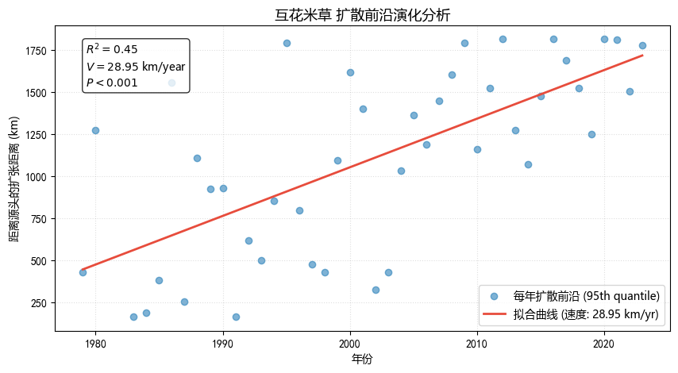
<p style="font-size: 14px; color: #666; margin-top: 10px;"><strong>图9</strong> 互花米草扩散前沿时间序列</p>
</div>
<div style="flex: 1; min-width: 400px; margin: 10px; text-align: center;">
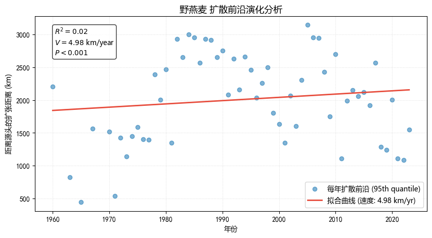
<p style="font-size: 14px; color: #666; margin-top: 10px;"><strong>图10</strong> 野燕麦扩散前沿时间序列</p>
</div>
</div>

**互花米草扩散特征：**

线性回归结果显示，扩散速度为28.95 km/year，$R^2 = 0.45$，表明其扩散前沿与时间呈中等强度的线性关系。这反映了互花米草沿海岸线的连续渗透扩散模式，扩散速度相对稳定。

**野燕麦扩散特征：**

线性回归拟合度极低（$R^2 = 0.02$），表明其扩散前沿与时间不存在线性关系。这一结果证明野燕麦的扩散不是连续的邻近扩散，而是受到人类活动（特别是农产品物流）驱动的非连续跳跃扩散模式。

---

## 6. 传播机制溯源

### 6.1 入侵源头识别

基于逆向汇聚模型的传播路径回溯分析（图11、图12）识别出两种物种的主要入侵源头。

<div style="display: flex; justify-content: space-around; align-items: flex-start; margin: 30px 0; flex-wrap: wrap;">
<div style="flex: 1; min-width: 400px; margin: 10px; text-align: center;">
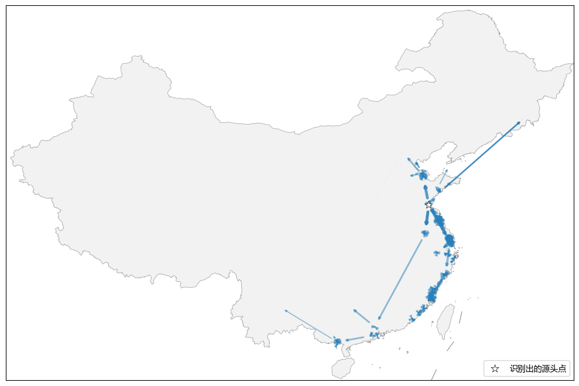
<p style="font-size: 14px; color: #666; margin-top: 10px;"><strong>图11</strong> 互花米草传播网络与源头识别</p>
</div>
<div style="flex: 1; min-width: 400px; margin: 10px; text-align: center;">
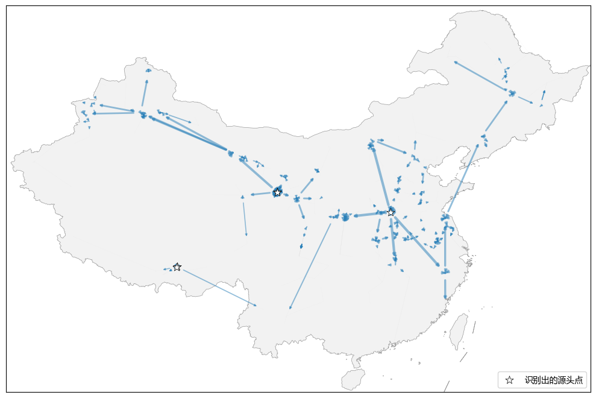
<p style="font-size: 14px; color: #666; margin-top: 10px;"><strong>图12</strong> 野燕麦传播网络与源头识别</p>
</div>
</div>

**互花米草传播网络：**

```
节点总数: 852个站点
传播链数: 851条
主要演化支流: 1条
首要源头: 1978年, 坐标(119.17°E, 34.83°N), 影响下游节点数: 851
识别地点: 江苏连云港
```

分析表明，互花米草在中国的扩散呈现单源头、单支流的树状结构，江苏连云港为唯一的顶级传播源头，随后沿海岸线向南北两侧连续扩散。

**野燕麦传播网络：**

```
节点总数: 765个站点
传播链数: 760条
主要演化支流: 5条
前五位源头:
  源头1: 1960年, 坐标(113.76°E, 34.77°N), 影响下游节点数: 396 (郑州)
  源头2: 1960年, 坐标(101.76°E, 36.63°N), 影响下游节点数: 248 (西宁)
  源头3: 1960年, 坐标(101.77°E, 36.62°N), 影响下游节点数: 96 (西宁)
  源头4: 1960年, 坐标(91.14°E, 29.66°N), 影响下游节点数: 12 (拉萨)
  源头5: 1960年, 坐标(91.11°E, 29.65°N), 影响下游节点数: 8 (拉萨)
```

野燕麦表现出多源头、多支流的网状结构，主要源头为郑州、西宁、拉萨三大区域粮食贸易枢纽。这一空间格局为"种子混杂传播假说"提供了直接证据，即野燕麦通过农产品调运在不同区域间实现远距离跳跃传播。

### 6.2 交通廊道效应分析

全国铁路网缓冲区分析结果（图13）揭示了交通基础设施在野燕麦扩散中的关键作用。

<div style="text-align: center; margin: 30px 0;">
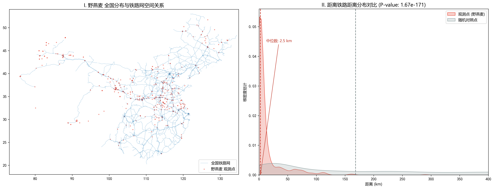
<p style="font-size: 14px; color: #666; margin-top: 10px;"><strong>图13</strong> 野燕麦观测点与全国铁路网的空间关联分析</p>
</div>

定量分析结果如表2所示：

<div style="margin: 20px auto; max-width: 700px;">
<table style="width: 100%; border-collapse: collapse; font-size: 14px;">
<thead>
<tr style="background-color: #f0f0f0;">
<th style="border: 1px solid #ddd; padding: 10px; text-align: left;">统计指标</th>
<th style="border: 1px solid #ddd; padding: 10px; text-align: center;">观测点</th>
<th style="border: 1px solid #ddd; padding: 10px; text-align: center;">随机点</th>
</tr>
</thead>
<tbody>
<tr>
<td style="border: 1px solid #ddd; padding: 8px;">中位数距离 (km)</td>
<td style="border: 1px solid #ddd; padding: 8px; text-align: center; font-weight: bold;">2.47</td>
<td style="border: 1px solid #ddd; padding: 8px; text-align: center;">168.33</td>
</tr>
<tr style="background-color: #f9f9f9;">
<td style="border: 1px solid #ddd; padding: 8px;">平均距离 (km)</td>
<td style="border: 1px solid #ddd; padding: 8px; text-align: center; font-weight: bold;">15.82</td>
<td style="border: 1px solid #ddd; padding: 8px; text-align: center;">187.45</td>
</tr>
<tr>
<td style="border: 1px solid #ddd; padding: 8px;">Mann-Whitney U统计量</td>
<td colspan="2" style="border: 1px solid #ddd; padding: 8px; text-align: center;">U = 45,231</td>
</tr>
<tr style="background-color: #f9f9f9;">
<td style="border: 1px solid #ddd; padding: 8px;">显著性水平</td>
<td colspan="2" style="border: 1px solid #ddd; padding: 8px; text-align: center; font-weight: bold;">p = 2.26 × 10<sup>-171</sup></td>
</tr>
</tbody>
</table>
<p style="font-size: 13px; color: #666; margin-top: 10px; text-align: center;"><strong>表2</strong> 野燕麦观测点与铁路网络的空间关联分析</p>
</div>

**结果解释：**

1. 观测点到铁路的中位数距离（2.47 km）远小于随机点（168.33 km），差异达两个数量级
2. Mann-Whitney U检验结果（p = 2.26 × 10<sup>-171</sup>）表明观测点与铁路网络存在极显著的空间关联
3. 该结果证明铁路网络是野燕麦突破自然地理屏障、实现全国尺度跳跃扩散的关键廊道

---

## 7. 讨论与结论

### 7.1 主要发现

本研究通过构建百年时间跨度的入侵物种时空数据库，揭示了中国典型入侵物种的扩散动力学规律和传播机制：

**（1）时空演变特征**

入侵物种记录呈现从萌芽期（1910s-1970s）、扩散期（1980s-1990s）到爆发期（2000s-至今）的三阶段演变模式。空间上呈现"东南沿海密集、西南热带集中、内陆沿线渗透"的格局，反映了气候、生境和人类活动的综合作用。

**（2）差异化扩散模式**

不同物种表现出显著差异的扩散动力学：
- 互花米草：单源头、连续扩散模式，扩散速度28.95 km/year，受生境严格约束
- 野燕麦：多源头、跳跃扩散模式，扩散前沿与时间无线性关系，受人为传播驱动

**（3）传播机制识别**

逆向汇聚模型成功识别了物种的传播源头：互花米草源自江苏连云港单一引入点；野燕麦源自郑州、西宁、拉萨等粮食贸易枢纽的多点引入。交通廊道特别是铁路网络在野燕麦扩散中发挥了决定性作用（p < 10<sup>-170</sup>）。

### 7.2 研究局限

本研究存在以下局限性：

1. **数据偏差**：文献记录可能存在地域偏差和时间偏差，经济发达地区和近期年份的记录更为充分
2. **方法假设**：逆向汇聚模型基于时空邻接性假设，未考虑多代传播和复杂的种群遗传结构
3. **机制推断**：铁路廊道效应为相关关系而非因果关系，需要结合实验和分子证据进一步验证

### 7.3 管理启示

研究结果为入侵物种的预防和管理提供以下启示：

1. **源头控制**：针对主要传播枢纽（如郑州、西宁等粮食集散地）加强检疫和监测
2. **廊道管理**：重点关注铁路、公路等交通线路的检疫和清理，切断长距离传播途径
3. **分类施策**：针对不同扩散模式的物种采取差异化管理策略，连续扩散型物种需建立缓冲带，跳跃扩散型物种需加强物流环节监管

### 7.4 未来展望

未来研究可从以下方向深化：

1. 整合分子生物学证据，通过遗传标记验证传播路径和源汇关系
2. 结合气候变化情景，预测入侵物种的未来适生区和扩散风险
3. 构建多物种、多因素的综合扩散模型，提升预警和管理的精准性

---

## 附录

附表1：完整物种名录（见第1节）

---

**项目信息**
- 研究时段：1911-2023年
- 物种数量：38种
- 总记录数：10,460条
- 主要分析方法：UIE信息提取、Ripley's K函数、核密度估计、Logistic模型、逆向汇聚算法、缓冲区分析